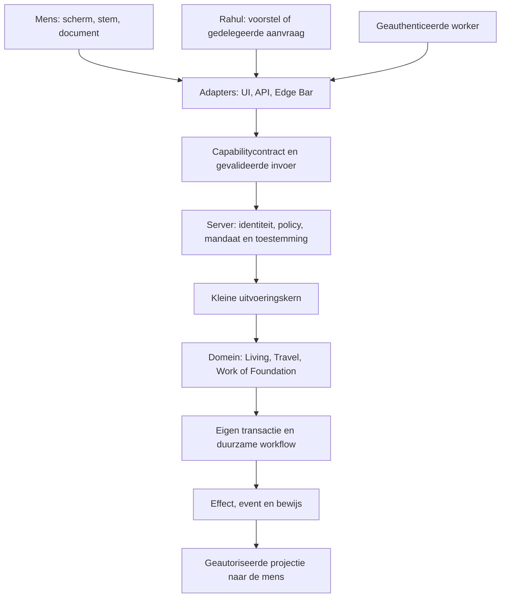

# RTG 2030 — veranderen zonder het platform te verbouwen

Status: ontwerpvoorstel, geen verklaring dat deze architectuur al is geïmplementeerd.
Onderzocht op 22 september 2026, broncommit
`3af1a3edba382aee9bdf7b45a294ff35691a9765`.

Dit document concretiseert [OS.md](../OS.md), [PLATFORM.md](../PLATFORM.md) en
[de bestaande architectuurkaart](../ARCHITECTUUR.md). Bestaande domeinen, gegevens,
bevoegdheden en releasebewijzen zijn het vertrekpunt. De productiestatus verandert
door dit ontwerp niet. De eerstvolgende implementatie is de afgebakende
[documentenpilot](rtg-2030-documenten.md).

## 1. De ontwerpbeslissing

RTG krijgt één betekeniscontract voor een uitvoerbare capability, met specifieke
domeinsemantiek. Interfaces projecteren dat contract; de server dwingt het af.
Een nieuwe taal, wereld, AI-provider of gebruikersinterface krijgt daarmee een
aansluiting op hetzelfde gedrag. Een contract is pas betrouwbaar wanneer de
implementatie en de relevante foutpaden ermee overeenkomen.

Begin als modulair platform binnen de bestaande deployment. Splits een dienst
pas fysiek af wanneer onafhankelijk schalen, isolatie of beheer dat rechtvaardigt.
De 238 gedeelde kernnamen uit de architectuurkaart zijn een inventaris van
afhankelijkheden, geen opdracht voor 238 microservices.

De kernel doet drie dingen: een geverifieerde uitvoeringscontext doorgeven, het
contract en de beleidsuitkomst afdwingen, en de uitvoering aan het juiste domein
overdragen. Identity, crypto, events, observability en opslag hebben afgebakende
interfaces. Hun volledige implementaties hoeven niet in één kernelmodule te wonen.
De kernel importeert geen appschermen, restaurantregels of loonberekeningen.

Een domein bezit zijn gegevens en invarianten. Een ander domein gebruikt een
contract of event en leest niet rechtstreeks diens tabellen of interne objecten.
Gedeelde opslag blijft mogelijk, maar maakt gegevens niet gedeeld eigendom.

## 2. Wat er al is en welke overgang nodig is

Dit is gerichte brondiscovery. Een genoemd bestand bewijst aanwezige code, geen
volledige dekking of werking in productie.

| Onderdeel | Bestaande aansluiting | Ontwerpbeslissing |
|---|---|---|
| Capabilitybegrippen | [CAPABILITEIT.json](../CAPABILITEIT.json), [meetwijze](../scripts/capabilities.js) | Het register telt 21 woordenlijsten met verschillende betekenissen. Scheid uitvoerbare actie, juridisch vermogen, beschikbaarheid en productcategorie. |
| Module- en actielaag | [Module SDK](../public/shared/interface/module-sdk.js), [broker](../public/shared/interface/workspace-broker.js) | Hergebruik manifests en bediening. Browserpolicy en gelijktijdige deduplicatie zijn geen serverautorisatie of duurzame idempotentie. |
| Beleid en Rahul | [workspacepolicy](../public/shared/interface/workspace-policy.js), [mandaatpoort](../server/kern/stuur/mandaatpoort.js) | Migreer beslissingen naar één contract met handhaving bij het effect. De mandaatpoort kent een schaduwstand; aanwezigheid van deze module bewijst geen platformbrede afdwinging. |
| Identiteit | [WebAuthn-routes](../server/routes/auth/webauthn.js), [stap-op](../server/kern/webauthn-stapop.js) | Bouw voort op passkeys en de binding aan account en handeling; verifieer de complete recovery- en deviceketen. |
| Releasevertrouwen | [drie rollen](../deploy/TRUST.md), [verifier](../server/config/release-trust.js) | Behoud afzonderlijk build-, evidence- en promotiegezag. Voeg later algoritmewendbaarheid toe binnen dit protocol. |
| Herhaling en opslag | [idempotentiemiddleware](../server/middleware/idempotentie.js), [duurzame bevestiging](../server/lib/duurzaam.js) | Respecteer bestaande domeinspecialisten. Een geheugenbuffer en een HTTP-retry vormen samen nog geen duurzame workflow. |
| Gebeurtenissen en privacy | [envelop](../server/kern/envelop.js), [bewaarbeleid](../server/bewaarbeleid.js), [logredactie](../server/log-redactie.js) | Breid correlatie, classificatie en bewaarbeleid uit tot veldniveau en exportgrenzen. |
| Offline en herstel | [Zaakdoos](../server/kern/zaakdoos/index.js), [klok](../server/lib/klok.js) | Hergebruik de beperkte offline ervaring en injecteerbare tijd. Dit is nog geen algemene sync-engine of deterministische replay. |
| Menselijke documentbesluiten | [Office-workflow](../server/kern/office/workflow.js) | Bind een goedkeuring servermatig aan actor, invoer, resourceversie en doel. Een door de client gestuurd `mens: true` is op zichzelf geen bewijs van menselijke goedkeuring. |

## 3. Het capabilitycontract

Een capability beschrijft een betekenis, bijvoorbeeld `document.trash`, en niet
alleen een route. Eén route kan nu meerdere betekenissen hebben; meerdere routes
kunnen straks dezelfde capability bedienen. Het contract draagt:

- stabiel betekenis-ID, versie, domeineigenaar en levenscyclus;
- input- en outputschema, resource, voorvoorwaarden en toegestane stateovergang;
- actor-, tenant-, delegatie-, consent- en step-upvereisten;
- risico, gegevensclassificatie, toegestane en verboden effecten;
- transactiegrens, idempotentiescope, concurrencyregel en bevestigingsmoment;
- timeout, retry, annulering, compensatie en herstel;
- audit/event-schema, relevante testclaims en bewijsverwijzingen;
- vertaal-ID's en presentatiehints voor de Edge Bar, formulieren en Rahul.

Hetzelfde contract voedt documentatie, toolbeschrijvingen, UI-acties en discovery.
Gegenereerde tests kunnen een contract controleren, maar bewijzen niet dat het
contract zelf de juiste betekenis heeft. Domeinbeoordeling blijft nodig.
Een vertaling verandert geen capability-ID, bevoegdheid of stateovergang.
Kritieke bevestigingstekst heeft een beoordeelde betekenis en versie.

Houd beschrijving, beschikbaarheid, autorisatie en bewezen werking afzonderlijk.
Een geregistreerde capability kan beschreven zijn terwijl uitvoering nog niet is
toegestaan. Publiceer AI-tools en productclaims alleen voor expliciet vrijgegeven
capabilities.

## 4. Policy en menselijke regie

De server leidt de actor en diens bevoegdheden af uit geverifieerde identiteit.
Door de aanvrager opgegeven rollen, `owner`, `tenant`, risicoklasse of een boolean
voor menselijke toestemming gelden niet als gezag.

Het beleidsbesluit bevat een basisuitkomst, reden, beleidsversie en verplichtingen.
De zichtbare uitkomsten zijn `ALLOW`, `DENY`, `REQUIRE_CONSENT` en
`REQUIRE_STEP_UP`. Toestemming en step-up kunnen beide vereist zijn. Na vervulling
volgt een nieuwe beoordeling; geen van beide heft een `DENY` op.

Handhaving zit bij HTTP, objectqueries, search, cache, realtime-abonnementen,
workers en de definitieve mutatie. Een gedeeld policycontract vereist niet dat
iedere controle een extra netwerkverzoek maakt. Versieer beslisregels en begrens
caching. Intrekking en gewijzigde resourceversies moeten vóór een later effect
opnieuw worden gecontroleerd. Een onbekende of onbeschikbare kritieke beslissing
weigert uitvoering.

Rahul mag een plan voorstellen en capabilities aanvragen binnen een geverifieerd
mandaat. Bevestiging bindt de mens aan de concrete effecten en invoerhash, met
vervalmoment en eenmalig gebruik waar nodig. Toestemming om een plan te bekijken
is geen toestemming om het uit te voeren. RTG blijft bruikbaar zonder model.

## 5. Duurzame uitvoering, tijd en privacy

Een workflow legt intentie, stap, versie en resultaat duurzaam vast. Een lokale
stateovergang en het bijbehorende uitgaande event worden waar nodig atomair
opgeslagen; aflevering mag worden herhaald. Ontvangers verwerken een event-ID
binnen hun eigen duurzame transactie. Een provider krijgt een stabiele
operatiesleutel. Bij onzekere uitkomst volgt statusopvraging/reconciliation,
niet blind een tweede financiële handeling.

Garandeer geen algemene exactly-once aflevering. Bewijs per effect dat herhaling
de invariant bewaart. Definieer volgorde per resource, concurrerende schrijvers,
versieconflicten, leases/fencing en een begrensde herstelwachtrij. Compensatie is
een nieuwe handeling met eigen bevoegdheid en kan zelf falen.

Bij geld, consent, bevoegdheden en contracten worden huidige state en relevante
historie samen verklaarbaar gehouden. Onderscheid gebeurtenistijd, registratietijd
en geldigheid; gebruik een resourceversie voor volgorde in plaats van alleen de
wandklok. Oude auditfeiten geven een ingetrokken bevoegdheid niet opnieuw toegang.

De bestaande envelop kent `openbaar`, `intern`, `persoonsgegeven`, `bijzonder` en
`onbekend`. Introduceer de voorgestelde Engelse labels via een expliciete mapping.
`SENSITIVE` en `HIGHLY_RESTRICTED` vragen aanvullende definities; maak van
`bijzonder` niet automatisch een brede verzamelcategorie. `onbekend` blijft
behouden en krijgt geen publieke export als standaard.

Classificatie geldt ook voor afgeleide data, traces, caches, prompts, exports en
replaybestanden. Leg per veld doel, bewaartermijn, verwerkingregio en toegestane
ontvangers vast. Observability gebruikt een toelatingslijst en begrensde labels;
geen tokens, documenten of vrije gebruikersinvoer als standaard attributen.
Bewaar in onveranderbare events zo weinig mogelijk persoonsgegevens. Regel
verwijdering en rechtmatige bewaarplichten voor verwijzingen, blobs en back-ups
afzonderlijk; cryptografische integriteit vervangt dat beleid niet.

## 6. Technologie en vervangbaarheid

| Ontwikkeling | Keuze voor RTG | Grens vóór invoering |
|---|---|---|
| Passkey-first | Bestaande WebAuthn-keten uitbreiden; gerichte step-up | RP-ID/origin, bestaande accounts, herstel, ingetrokken credentials, synced/device-bound verschillen en echte browser/authenticatormatrix bewijzen. Attestation alleen waar beleid en privacy dat rechtvaardigen. |
| Crypto-agility | `SignatureProvider`, `KeyProvider`, `KEMProvider`, `HashProvider` en `TrustPolicy` als gerichte aansluitingen | Verifier kiest vertrouwde algoritmen en rolankers. Bind domein, protocolversie, sleutel-ID en algoritme aan het statement; weiger downgrade en onbekende suites. Een aanvrager kiest niet zelf een minder streng algoritme. |
| Post-quantum | Cryptoinventaris, bewaarrisico en interoperabiliteitsproeven voorbereiden | ML-KEM is sleutelinkapseling; ML-DSA en SLH-DSA zijn signatures. Alleen onderhouden implementaties en beoordeelde protocollen gebruiken. Een hybride combinatie vraagt een expliciet verificatiebeleid en migratie-/rollbackbewijs. |
| Local-first | Begin bij persoonlijke concepten en omkeerbare, afgebakende acties | Per gegeven mergebeleid, versies/tombstones, encryptie, conflict-UI, quota en intrekking. Rechten opnieuw controleren bij synchronisatie. Een offline voorstel is geen bevestigde betaling of boeking. |
| Edge | Eerst publieke assets en waar verantwoord geautoriseerde reads | Gegevenslocatie, tenantcachekeys, versheid en intrekking vastleggen. Geen wereldwijde cache van een kritisch autorisatiebesluit zonder begrensde geldigheid. |
| Workload identity | Gebruiker, device, service, build en artifact krijgen onderscheiden identiteit | Audience en capabilityscope, kortlevende credentials, rotatie, intrekking en audit. Identiteit volgt een proces niet automatisch omdat het op hetzelfde netwerk staat. |
| Observability | Correlatie van capability, workflow, event, trace en release | Metingen mogen uitvoering niet onbeheerst vertragen of gevoelige data exporteren. Een verplichte auditcommit heeft andere foutsemantiek dan optionele telemetry. Profiles blijven verwisselbaar en uitschakelbaar. |
| Database/provider vervangen | Domeincontract en provideradapter behouden | Transacties, isolation, ordering, querygedrag, migraties en foutsemantiek opnieuw bewijzen. Een interface maakt vervanging begrensd, niet kosteloos. |

### Gecontroleerde standaardstatus

WebAuthn Level 3 is een W3C Recommendation van **25 augustus 2026**. Dat bepaalt
de standaardstatus, niet welke optionele functies alle RTG-apparaten ondersteunen.
[W3C-publicatie](https://www.w3.org/TR/2026/REC-webauthn-3-20260825/).

NIST CSWP 39 verscheen in december 2025 en kreeg op **29 juni 2026** een update.
Het behandelt vervanging van cryptografische mechanismen met behoud van beveiliging
en werking. [NIST crypto-agility](https://csrc.nist.gov/pubs/cswp/39/upd1/considerations-for-achieving-crypto-agility/final).
ML-KEM, ML-DSA en SLH-DSA zijn sinds augustus 2024 gestandaardiseerd; RTG-adoptie
vereist daarnaast passende protocollen en implementaties.
[FIPS 203](https://csrc.nist.gov/pubs/fips/203/final),
[FIPS 204](https://csrc.nist.gov/pubs/fips/204/final),
[FIPS 205](https://csrc.nist.gov/pubs/fips/205/final).

OpenTelemetry Profiles staat op **Alpha**. De public-alpha-aankondiging beschrijft
ook de eBPF-integratie. Voor RTG is dit een optionele proef achter een adapter.
[Specificatie](https://opentelemetry.io/docs/specs/otel/profiles/),
[aankondiging](https://opentelemetry.io/blog/2026/profiles-alpha/).

## 7. Risico en bewijs

R0–R5 zijn voorgestelde engineeringklassen en staan los van P0–P2 voor bevindingen.
Map ze op bestaande risicolijsten voordat runtimebeslissingen ervan afhangen.
Alle klassen behouden noodzakelijke autorisatie, privacy en toegankelijkheid.

| Klasse | Typisch effect | Aanvullend minimum |
|---|---|---|
| R0 | Presentatie zonder mutatie | Correcte weergave, toegankelijke bediening en gegevensgrenzen |
| R1 | Omkeerbare persoonlijke mutatie | Eigenaar, persistence, herhalen, versieconflict en herstel |
| R2 | Mutatie met effect op anderen | Actor/resource/tenantmatrix, tweede actor en intrekking |
| R3 | Bedrijfsoperatie | Volledig domeincontract, concurrency, duurzame keten en herstel |
| R4 | Identiteit, beveiliging of juridisch gezag | Sterke bevestiging waar vereist, audit, delegatie- en recoverygrenzen |
| R5 | Geld of onomkeerbaar effect | Effectspecifieke invarianten, crash/retry/reconciliation en kandidaatgebonden bewijs; ledgerbewijzen wanneer economische waarde verandert |

De hoogste toepasselijke klasse geldt; specifieke omstandigheden kunnen een
handeling verzwaren. Een read van zeer gevoelige data valt niet automatisch
onder R0. Een bulkactie krijgt een eigen grens en kan zwaarder zijn dan één item.

De bestaande releaseketen blijft leidend: exact artifact, betekenis, isolatie,
geld, extern bewijs, journeys/devices en rollback. Aanvullende signatures maken
bewijs verifieerbaar maar verklaren een niet-geteste invariant niet waar.
Een releasebesluit noemt commit, digest, configuratie, migraties, policyversies en
evidence. Promotie en runtime moeten dezelfde identiteit controleren. Een geldige
buildhandtekening verleent geen promotiebevoegdheid. Oude sleutels en statements
blijven historisch leesbaar volgens beleid, zonder ingetrokken gezag te herstellen.

## 8. Simulation en replay

Begin RTG Simulation bij de documentenpilot en daarna de bestaande MONEY-012-
bewijsnaad. Gebruik synthetische actors, gegevens en afgeschermde dependencies.
Geef iedere simulatie een seed, klok, beginsnapshot, contract-/policyversie en
artifact-identiteit. Stel pas daarna grotere populaties samen op basis van
waargenomen verkeerspatronen en benodigde capaciteit.

Isoleer fault injection tot het testproces, de container of expliciete dependency.
Registreer onderbrekingsmoment, laatste duurzame stap en herstelasserties. Een
gesimuleerde provider blijft als simulatie gelabeld; echt sandboxgedrag levert
afzonderlijk extern bewijs.

Deterministische replay vraagt registratie of injectie van alle relevante
onvoorspelbaarheid: tijd, toeval, volgorde, providerresultaten en modeluitvoer.
Een LLM opnieuw aanroepen of requests uit een log herhalen is niet deterministisch.
Replay adapters blokkeren echte uitgaande effecten. Alleen een beperkt,
gesanitiseerd incidentpakket met passende bewaartermijn mag uit productie komen.

## 9. Migratie met concrete eindpunten

De bestaande G1- en MONEY-012-closure blijft een zelfstandig prioritair
releasepad. De documentenpilot is geen voorwaarde om dat bewijs te leveren.

| Stap | Levering | Klaar wanneer |
|---|---|---|
| A — betekenis vastleggen | Documentenpilot met onderscheiden acties en bestaande routekoppeling | Domeincontracten zijn beoordeeld; alle huidige aanroepers en verschillen zijn bekend. |
| B — één verticale implementatie | Serverhandhaving, opslag en gedeelde UI/API-aanroep voor trash/restore | Herhalen kan niet permanent verwijderen; versieconflict, verkeerde actor, restart en persistence zijn bewezen. De fallback kan deze grens niet omzeilen. |
| C — kritieke release sluiten | Bestaande signing-bootstrap en MONEY-012 in afgeschermde representatieve omgeving | Het exacte artifact en de benodigde financiële invarianten hebben het al gevraagde bewijs. Nieuw architectuurwerk vervangt dat bewijs niet. |
| D1 — Messaging | Gebruiker → bericht → duurzame gebeurtenis → ontvanger | Realtime/eventmodel en reconnect zijn bewezen. |
| D2 — Identity | Gedeelde policy en trust | Actuele bevoegdheid, intrekking en consent zijn aan dezelfde capabilitygrens bewezen. |
| D3 — Work / Planning | Complete workflows met meerdere betrokkenen | Planning, conflicten en herstel zijn duurzaam en verklaarbaar. |
| D4 — Money | Gecontroleerde R5-migratie | Ledger, idempotentie en reconciliation zijn bewezen zonder gelijktijdig het capabilitymodel uit te vinden. |
| E — exploitatie aantonen | Workload identity, telemetry, capaciteitsmeting, SLO en herstelrepetitie | Grenzen zijn gemeten onder representatieve belasting; verantwoordelijke beheerders kunnen storingen afhandelen. |
| F — adapters beproeven | Afzonderlijke lokale sync-, PQC- en profilingproeven | Adapter kan veilig worden vervangen/uitgezet; interoperabiliteit, overhead, datagrens en terugweg zijn bewezen. |

Money komt bewust later in de **architectuurmigratie**. MONEY-012 blijft ondertussen een afzonderlijke P0-releaseblokkade en wordt daardoor niet uitgesteld.

Geen kalenderbelofte zonder gemeten doorlooptijd. Houd wijzigingen klein genoeg
voor review en rollback. Vergelijk de nieuwe policy eerst zonder extra effecten,
maar handhaaf de bestaande beveiligingsgrens tijdens die schaduwperiode. Voer een
mutatie nooit twee keer uit om de implementaties te vergelijken.

Voor iedere uitbreiding geldt dezelfde keuzevraag: welk bestaand contract wordt
duidelijker, welke oude afhankelijkheid verdwijnt en welk bewijs toont dat aan?
Zo wordt de architectuur kleiner waar hij generiek moet zijn, en preciezer waar
het domein ertoe doet. FoundationOS blijft altijd 100% gratis.

## 10. Richting na de pilot

Aangevuld op 24 september 2026. Deze paragraaf voegt geen architectuur toe. Zij
legt vast wat er ná de documentenpilot wel en niet bij mag komen.

**Hoofdregel: afmaken gaat voor vooruitlopen.** Stap C van §9 (signing en
MONEY-012), het appbewijs, de testwereld, passkeys aan de kantoordeur en de
AI-terugwegen gaan voor alles in deze paragraaf. Capabilitycontracten, continue
autorisatie, step-up, AI zonder root, crypto-agility, cellen (`SOEVEREIN.md`),
één geldpoort, voorstelsemantiek en gecontroleerd terugschakelen zijn al
vastgelegd of deels gebouwd. Die worden niet opnieuw ontworpen maar
geïmplementeerd, aangesloten, gemeten en bewezen. `documents.trash@1` is het
referentiepatroon voor het samenbrengen van interfaces die dezelfde betekenis
uitvoeren.

**Frontiertechniek mag niet blijven omdat ze modern is.** Een proef hieronder
begint pas na stap C, draait geïsoleerd en heeft vooraf een stopcriterium. Een
proef blijft alleen als ze een bestaande RTG-meting aantoonbaar verbetert.

### 10.1 Wat bewust niet wordt veralgemeend

Deze voorstellen zijn gemeten tegen bestaande grenzen en in deze vorm afgewezen.
Wat wel overleeft, staat erachter.

- **Een derde contextmodel.** Context blijft een projectie via
  `public/shared/edge/blikveld.js` (`EDGE.md`).
- **Een zesde gezagsvocabulaire voor Rahul.** De noemer `geen` / `tonen` /
  `klaarzetten` / `uitvoeren` blijft staan (INT-01). Onomkeerbaarheid is een
  eigenschap van een handeling en geen trede.
- **Universele werkwoorden zoals een generiek `delete`.** De betekenis-ID blijft
  per domein (§3; `COMMERCE.json` vond geen werkwoord dat alle domeinen delen).
  Een terugweg wordt niet verklaard maar beproefd (`HERSTELPROEF.json`).
- **Een stabiele persoons-URI.** Objecten krijgen een stabiele identiteit, een
  mens niet. Voor een mens blijft het de codenaam of het adres uit `LINK.md`
  (`HDI.md` par. 5.1, `scripts/afleidbaar.js`).
- **Eén allocatiemotor voor tafels, ritten en mensen.** De plandomeinen delen
  geen velden (`PLANVORM.json`), en een mens is geen resource (`PLANNING.md`).
- **Een verborgen relevantiescore.** De mixer verdeelt plekken en geen punten,
  en elke plek draagt zijn reden in woorden (`CONNECT.md`). Het systeem biedt
  een andere hoedanigheid aan, maar wisselt er nooit zelf naartoe (MN-02).

### 10.2 Vijf gemeten gaten

Elk onderwerp staat er met zes velden. Het laatste veld is de poort: zonder dat
bewijs gaat een proef niet verder dan de proefwereld.

**A. Semantische mutatiezoeker**

- *Principe:* een model verzint de aanval, de machine stelt vast of hij slaagt.
- *Bestaande drager:* `scripts/mutatie.js` met mechanische operatoren en de
  liegpoort, `scripts/sabotage.js` (elke wet één keer met opzet overtreden).
- *Gemeten gat:* niemand genereert plausibele *semantische* fouten. Voorbeelden:
  een cachesleutel zonder tenant, een capability die een rolwijziging overleeft,
  een batchroute die alleen het eerste object toetst, of een herstelpad dat
  nieuw beleid omzeilt. De zoeker uit `BEWIJSMACHINE.md` par. 5.2 varieert de
  invoer en niet de code: verwant, maar een andere vraag.
- *Volgende beweging:* een lokaal model stelt per invariant een mutant voor als
  diff, `mutatie.js` voert hem uit, en de uitslag is `gevangen` of `ongevangen`.
- *Grens:* bronfragmenten gaan alleen naar `LOCAL_AI_URL` (`CODE.md` besluit 3).
  Een ongevangen mutant is een bevinding over de bewijslaag en geen productbug.
  Een modelbevinding wordt pas een register nadat een mens hem heeft afgetekend.
- *Bewijs om door te gaan:* op een vaste startset (tenantisolatie en
  `documents.trash@1`) vindt de zoeker minstens één ongevangen mutant die geen
  mechanische operator voortbrengt, en een mens beoordeelt die als plausibel.
  **Stop** als hij alleen vindt wat de operatoren al dekken.

**B. Gegevensklasse per veld**

- *Principe:* één klasse per veld, waarop meerdere systemen varen.
- *Bestaande drager:* de classificatie in `server/kern/envelop.js`, de
  documentclassificatie in `server/kern/office/samen.js`, `bewaarbeleid.js`,
  `log-redactie.js` en de allowlist van AI-CONTEXT-01.
- *Gemeten gat:* er is geen klasse per veld (`KANTOORMACHT.md` §22).
- *Volgende beweging:* eerst meten, nog geen taxonomie. Welke velden bestaan er,
  en welke dragen via die vier bronnen al een impliciete klasse? De taxonomie
  volgt uit die meting.
- *Grens:* `onbekend` blijft onbekend en wordt nooit openbaar. Een klasse is een
  verklaring en wordt nooit geraden uit een veldnaam. Er komt geen tweede
  bewaarbeleid.
- *Bewijs om door te gaan:* de meting toont dat minstens twee consumenten
  (AI-context, logredactie, export, bewaring) vandaag iets verschillends zeggen
  over hetzelfde veld. **Stop** als ze al consistent zijn: dan wordt alleen de
  afwijkende consument aangescherpt.

**C. Documentmodel onder Office**

- *Principe:* HTML wordt een weergave, en het document een model met bewerkingen
  en historie.
- *Bestaande drager:* `server/kern/office/docs.js`, `samen.js` (opmerkingen en
  aanwezigheid) en het documentcontract v1.
- *Gemeten gat:* een tekstdocument ÍS HTML, via `execCommand` (`OFFICE.md`).
  Wijzigingen bijhouden, samen schrijven en DOCX zonder verlies ontbreken daardoor
  alle drie.
- *Volgende beweging:* eerst de eigenschappen vastleggen en pas daarna techniek
  kiezen (CRDT of operationele transformatie). De eigenschappen: convergentie,
  deterministisch samenvoegen, betekenis van ongedaan maken, opmerkingen en
  suggesties, offline naar online, historie, rechten bij synchronisatie,
  verwijderen en herstellen, en trouw bij export.
- *Grens:* een offline voorstel is geen bevestigd effect (§6). Rechten worden
  bij synchronisatie opnieuw getoetst. De classificatie reist mee naar elke
  uitgang. Samenvoegen geldt voor inhoud en nooit voor een stand.
- *Bewijs om door te gaan:* in de proefwereld komen twee live clients plus één
  offline client deterministisch op hetzelfde uit, over een vaste set scenario's
  en ook na een herstart. Bestaande documenten gaan verliesvrij heen en terug.
  **Stop** als er geen verliesvrije terugweg naar de huidige opslag is.

**D. AI-routering die om een reden escaleert**

- *Principe:* Rahul gebruikt de minst verstrekkende techniek die de bedoeling
  betrouwbaar voltooit.
- *Bestaande drager:* `server/kern/ai/router.js` in schaduwmodus (regels,
  algoritme, optimalisatie, voorspelling, AI), `LOCAL_AI_URL`,
  `RTG_EXTERNE_AI_UIT` en `server/kern/kosten/grens.js`.
- *Gemeten gat:* de router beslist niets. Een stap omhoog draagt geen reden, en
  zegt ook niet waarom gegevens het huis mochten verlaten.
- *Volgende beweging:* elke uitslag draagt de gekozen techniek, de reden waarom
  de lagere techniek niet volstond, en of de context naar buiten mocht.
- *Grens:* geen samengesteld cijfer (INT-04). Een externe stap hangt aan B: wat
  de klasse niet toestaat, gaat niet naar buiten. Uitval van AI maakt geen
  kernproces onbruikbaar.
- *Bewijs om door te gaan:* de schaduwmeting toont welk aandeel lager afgehandeld
  had kunnen worden, en een door mensen beoordeelde steekproef laat daar geen
  slechtere antwoorden zien. **Stop** als de lagere techniek in die steekproef
  vaker tekortschiet.

**E. Beperkingen en reistijd**

- *Principe:* de betekenis blijft bij het domein, en het oplossen van
  beperkingen wordt gedeeld.
- *Bestaande drager:* `PLANNING.md`,
  `server/kern/beveiliging/rooster/aanvragen.js` (sorteert op wat iemand
  toekomt), de heuristiek in `kern/agent.js` en de kaartlaag (`KAARTEN.md`).
- *Gemeten gat:* geen plandomein kent reistijd (`PLANVORM.json`), en er is geen
  constraint solver (de router zegt dat zelf).
- *Volgende beweging:* eerst reistijd als losse vraag (van A naar B kost T, met
  bron en graad). Daarna een solver die alleen een contract van beperkingen kent,
  zoals niet vóór X, A vóór B, minstens N minuten ertussen, of niet beschikbaar.
- *Grens:* een mens is geen resource en wordt niet op geschiktheid gerangschikt
  (CAR-05). De uitkomst is een voorstel dat een mens bevestigt. Een reistijd
  zonder bron heet onbekend en nooit nul (`KAARTEN.md` par. 6).
- *Bewijs om door te gaan:* dezelfde solver levert geldige voorstellen in twee
  domeinen met verschillende semantiek, bijvoorbeeld het beveiligingsrooster en
  ritten, zonder dat er een domeinbegrip in het solvercontract hoeft. **Stop**
  zodra het tweede domein dat wel nodig heeft: dan is het een adapter van één
  domein en wordt hij niet veralgemeend.

Volgorde tussen de vijf: A en B mogen parallel na stap C, D wacht op B, en C en E
zijn elk een eigen spoor. Welke als eerste begint, is een besluit van de
eigenaar.
